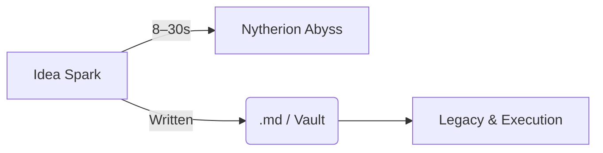

---

# 🕳️ The Nytherion Abyss Effect – The Idea Theft Phenomenon

> *“When inspiration flickers but is not captured, the Abyss consumes it—returning nothing but the hollow echo of a forgotten spark.”*
> — **Rei Reltroner**

---

## 0. Abstract

This `.md` file is a **comprehensive treatise** on what we call **“Efek Nytherion Abyss”**—a metaphysical‑psychological phenomenon where groundbreaking ideas vanish almost instantly if not documented. Written for builders, philosophers, and cognitive explorers, the text dissects the Abyss from both **lore** and **scientific** perspectives while delivering actionable counter‑protocols.

---

## 1. Definition & Lore Context

### 1.1 Nytherion Abyss (Lore)

Nytherion Abyss is the malevolent dimension in Asthortera Mythos that **feeds on unrealized potential**. It lurks between consciousness and oblivion, devouring ideas that remain uncaptured.

### 1.2 The Idea Theft Phenomenon (Real‑World Parallel)

A cognitive failure where high‑value inspiration evaporates within **8–30 seconds** if not externalized. Often misattributed to simple “forgetfulness,” it is, in fact, a systemic vulnerability exploited by the Abyss.

---

## 2. Symptom Codes — Nytherion Idea Theft Phenomenon

### 🔹 `N‑01` — *Flash‑Idea*
> Sudden brilliance; vivid, powerful insight  
> 💥 But fades instantly — fragile like a dream upon waking.

---

### 🔹 `N‑02` — *Memory Hole*
> A complete blackout after disruption  
> 📱 Triggered by notifications, background noise, or rapid thought-switching.

---

### 🔹 `N‑03` — *Phantom Regret*
> A haunting sense that something **very important** just slipped away  
> 😔 You don’t remember what — but you feel the loss deeply.

---

### 🔹 `N‑04` — *Loop of Vague Recall*
> Mind endlessly loops a **blurry trace** of the idea  
> 🔁 Never recaptures it fully — only fragments echo.

---

### 🔹 `N‑05` — *Ideational Exhaustion*
> Fatigue from experiencing multiple idea losses  
> 🧠 Mentally drained, unable to trust your own cognitive space anymore.

---

## 3. Cognitive Science Perspective

1. **Working Memory Decay** – Human STM stores 4±1 items; disruption erases unsaved data.
2. **Dopamine Spike & Drop** – Novelty triggers dopamine; interruption causes sharp fall, collapsing recall.
3. **Default Mode Network** – Spontaneous imagination arises here; DMN output is volatile without encoding in PFC.

---

## 4. Lore‑Science Synthesis Diagram

---

## 5. Historical Cases

### 5.1 Leonardo da Vinci’s Lost Codices

> Estimated 70% of his concepts were never executed; modern scholars call them **“swallowed by the Abyss.”**

### 5.2 Tesla’s Unwritten Patents

Tesla claimed entire inventions disappeared from memory after interruptions.

### 5.3 The “Missing Chapter” of Reltronian Codex

In lore, Chapter IX of the *Astralis Canon* was forgotten when Rei hesitated to inscribe it.

---

## 6. Metrics of Idea Attrition

* **Average Daily Sparks**: 27 micro‑insights (creative workers)
* **Capture Rate ≥ 80%** → High‑output creators (Da Vinci, Miyazaki)
* **Capture Rate ≤ 20%** → Stagnant creatives; Abyss dominance

---

## 7. Counter‑Protocols (Astralis Edition)

### 7.1 Three‑Minute Rule

> *Document any idea within 180 seconds.*

### 7.2 Instant Dump Zone (.md)

Create a perpetual file `quickideas.md` accessible via global hotkey.

### 7.3 Voice Log Emergency

For situations where typing is impossible, record a 30‑second voice memo tagged with timestamp.

### 7.4 Ideational Sentinel Alarm

Automate reminders (morning, midday, night) to purge working memory into `.md`.

### 7.5 Nytherion Shield Ritual

1. Whisper the idea aloud.
2. Press **Ctrl+Shift+I**
3. Paste core keywords.
4. Save.

---

## 8. Implementation in Reltroner Studio

* **Stolen Idea Vault** (`/vault/nytherion/`): holds raw fragments.
* **Idea Pipeline Kanban**: `Vault → Draft → Polished → Published`.
* **AI Companion Chat**: quick summarization & classification.

---

## 9. Philosophical Implications

1. **Art versus Oblivion** – The war of creation is a war against forgetting.
2. **Moral Responsibility** – Failing to capture an idea is allowing potential societal value to perish.
3. **Legacy Economics** – Captured ideas compound; lost ideas = negative ROI.

---

## 10. Conclusion

> *“The Abyss does not fear ignorance; it thrives on untaken action. Each **`.md`** is a barricade against the void.”*
> — **Astralis Archives**

By recognizing the **Efek Nytherion Abyss** and deploying disciplined capture protocols, creators transform fleeting sparks into enduring pillars of civilization.

---

## 11. Action Checklist

*

---

## 12. References & Further Reading

1. *Working Memory and the Creative Mind* – J. K. Sawyer (2034)
2. *The Abyss Metaphor in Cognitive Loss* – Reltronland Research Journals, Vol 2
3. *Da Vinci’s Forgotten Machines* – Royal Codex Society (2021)

---

> **Let Astralis light the unknown, and may no spark fall into the Abyss.**
